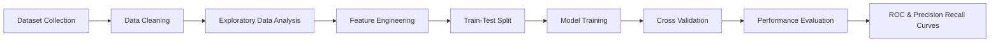

# 🩺 Diabetes Prediction & Exploratory Data Analysis

> 🚀 A Professional Machine Learning Project for Predicting Diabetes Using Advanced Data Analytics, Visualization, and Classification Models.

---

# 🌟 Project Highlights

✨ End-to-End Machine Learning Workflow
📊 Advanced Exploratory Data Analysis (EDA)
🧠 Multiple Machine Learning Models
📈 ROC Curve & Precision-Recall Evaluation
⚙️ Feature Engineering & Data Preprocessing
🩻 Healthcare Data Analytics Focus
📉 Statistical Visualization & Insights
🚀 Production-Scale Project Structure
📚 Portfolio & Resume Ready Documentation


---

# 📌 Project Overview

The **Diabetes Prediction Project** is a comprehensive healthcare analytics and machine learning solution designed to predict whether a patient is diabetic based on several medical and lifestyle-related features.

This notebook demonstrates a complete data science lifecycle, including:

🔍 Data Understanding
🧹 Data Cleaning & Preprocessing
📊 Exploratory Data Analysis
⚙️ Feature Engineering
🧠 Machine Learning Model Building
📈 Performance Evaluation
📉 Visualization & Interpretation
🚀 Scalable Workflow Design

The project combines healthcare analytics with predictive modeling techniques to generate meaningful insights from structured medical datasets.

It is highly suitable for:

🎓 Academic Projects
💼 Professional Portfolios
📚 Machine Learning Practice
🏥 Healthcare Analytics Demonstrations
🚀 Internship & Job Applications

This project focuses on **Diabetes Prediction using Machine Learning** combined with comprehensive **Exploratory Data Analysis (EDA)** and feature engineering techniques.

The notebook performs:

* Data collection and preprocessing
* Exploratory statistical analysis
* Data visualization and correlation analysis
* Feature engineering and categorical normalization
* Train/Test splitting with stratification
* Multiple machine learning model evaluations
* ROC Curve and Precision-Recall analysis
* Performance comparison using classification metrics

The primary objective is to build a robust predictive system capable of identifying diabetic and non-diabetic cases using patient health attributes.

---

# 🎯 Objectives

The main goal of this project is to build an intelligent diabetes prediction system capable of analyzing patient information and predicting diabetic conditions with high reliability.

## ✅ Core Objectives

🔹 Understand healthcare dataset structure and relationships
🔹 Analyze medical patterns using statistical methods
🔹 Visualize important healthcare indicators
🔹 Clean and preprocess raw patient records
🔹 Handle categorical and numerical variables efficiently
🔹 Train and evaluate multiple ML classification models
🔹 Compare model performance using standard metrics
🔹 Build a reusable and scalable ML workflow
🔹 Demonstrate production-oriented machine learning practices

## Main Goals

✔ Analyze diabetes-related healthcare data
✔ Detect hidden patterns and correlations
✔ Clean and preprocess raw healthcare records
✔ Train multiple machine learning classification models
✔ Compare model performance using industry-standard metrics
✔ Visualize predictive performance using ROC and PR curves
✔ Build a scalable workflow suitable for real-world healthcare analytics

---

# 🧠 Machine Learning Workflow



---

# 📂 Dataset Information

The project uses a diabetes healthcare dataset containing patient medical and lifestyle attributes.

## Features Used

| Feature                            | Description               |
| ---------------------------------- | ------------------------- |
| `gender`                           | Patient gender            |
| `age`                              | Age of patient            |
| `hypertension`                     | Hypertension diagnosis    |
| `heart_disease`                    | Presence of heart disease |
| `smoking_history / smoking_status` | Smoking habits            |
| `bmi`                              | Body Mass Index           |
| `HbA1c_level`                      | Hemoglobin A1c level      |
| `blood_glucose_level`              | Blood glucose reading     |
| `diabetes`                         | Target variable           |

---

# 🔍 Exploratory Data Analysis (EDA)

Exploratory Data Analysis plays a major role in understanding healthcare patterns and uncovering relationships between medical variables.

The notebook includes detailed visual and statistical exploration techniques to better understand the dataset before model training.

## 📊 EDA Includes

### 🧾 Dataset Inspection

✔ Dataset shape analysis
✔ Feature data types
✔ Statistical summaries
✔ Missing value inspection
✔ Duplicate record checks

### 🚬 Smoking History Analysis

The project normalizes smoking categories into simplified groups for better analytical consistency.

### 📈 Correlation Analysis

A correlation heatmap is used to identify relationships among:

🩸 Blood Glucose Level
⚖️ BMI
🧪 HbA1c Level
👤 Age
❤️ Heart Disease
🩺 Hypertension

### 📉 Distribution Analysis

The notebook visualizes:

📌 Diabetes class distribution
📌 Age distributions
📌 BMI variations
📌 Blood glucose comparisons
📌 HbA1c trends

### 📦 Outlier Detection

Boxplots and statistical techniques help identify abnormal healthcare readings.

### 🎨 Visualization Techniques Used

📊 Countplots
📈 Histograms
📉 Boxplots
🔥 Heatmaps
🧩 Stripplots
📍 Scatterplots

The notebook includes detailed EDA to understand the structure and quality of the dataset.

## Analysis Performed

### ✔ Dataset Inspection

* Shape of dataset
* Statistical summaries
* Data types
* Missing value detection

### ✔ Smoking History Analysis

The project analyzes smoking behavior categories and normalizes labels into simplified classes:

| Original Label | Transformed Label |
| -------------- | ----------------- |
| `never`        | `never`           |
| `former`       | `past`            |
| `not current`  | `past`            |
| `current`      | `active`          |
| `ever`         | `active`          |

### ✔ Correlation Analysis

A heatmap is generated to visualize relationships between medical variables.

### ✔ Class Distribution

The project visualizes diabetic vs non-diabetic distribution to identify imbalance.

### ✔ Blood Glucose Visualization

Boxplots and strip plots are used to compare blood glucose distributions between diabetic and non-diabetic patients.

---

# 📊 Example Visualizations

## Correlation Matrix Heatmap

```text
+--------------------------------+
| Feature Correlation Heatmap    |
| BMI ↔ Glucose ↔ HbA1c ↔ Age    |
+--------------------------------+
```

## Diabetes Distribution

```text
Non-Diabetic  ████████████████
Diabetic      ████
```

## ROC Curve Evaluation

```text
True Positive Rate
|
|            ROC Curve
|         .-''''''-.
|      .-'          '-.
|____/__________________> False Positive Rate
```

---

# ⚙️ Data Preprocessing

The preprocessing pipeline includes:

* Missing value inspection
* Data type correction
* Categorical normalization
* Feature separation (`X` and `y`)
* Stratified train-test split
* One-hot encoding using `ColumnTransformer`

---

# 🏗️ Model Development

The project trains multiple machine learning classification models to compare predictive performance and identify the most effective approach for diabetes prediction.

## 🧠 Models Implemented

| 🤖 Model                       | 📌 Purpose                         |
| ------------------------------ | ---------------------------------- |
| Logistic Regression            | 📈 Baseline linear classification  |
| Random Forest Classifier       | 🌲 Ensemble decision-tree learning |
| Support Vector Machine (SVM)   | 📏 Margin-based classification     |
| Additional sklearn classifiers | ⚡ Comparative experimentation      |

## ⚙️ Model Workflow

🧹 Data preprocessing
🔀 Train-test splitting
⚖️ Stratified sampling
🧠 Model fitting
📊 Prediction generation
📈 Metric evaluation
📉 ROC analysis

Multiple machine learning models are implemented for comparative analysis.

## Models Used

| Model                          | Purpose                     |
| ------------------------------ | --------------------------- |
| Logistic Regression            | Baseline linear classifier  |
| Random Forest Classifier       | Ensemble learning           |
| Support Vector Machine (SVM)   | Margin-based classification |
| Additional sklearn classifiers | Comparative benchmarking    |

---

# 🧪 Cross Validation Strategy

The project uses:

```python
StratifiedKFold(n_splits=5, shuffle=True, random_state=42)
```

This ensures:

* Balanced class representation
* Reduced overfitting risk
* Reliable model generalization
* Consistent evaluation metrics

---

# 📈 Evaluation Metrics

The project evaluates model performance using multiple industry-standard classification metrics.

## 📊 Metrics Used

| 📌 Metric | 🧠 Purpose                                |
| --------- | ----------------------------------------- |
| Accuracy  | ✔ Measures overall prediction correctness |
| Precision | 🎯 Measures positive prediction quality   |
| Recall    | 🩺 Measures detection sensitivity         |
| F1 Score  | ⚖️ Balances precision and recall          |
| ROC-AUC   | 📈 Measures ranking performance           |

## 📉 Why Multiple Metrics?

Healthcare datasets often contain class imbalance.

Using multiple evaluation metrics provides:

✔ Better model understanding
✔ Reliable medical prediction analysis
✔ Improved performance interpretation
✔ Reduced evaluation bias

The notebook evaluates models using:

| Metric    | Purpose                              |
| --------- | ------------------------------------ |
| Accuracy  | Overall prediction correctness       |
| Precision | False positive minimization          |
| Recall    | Detection sensitivity                |
| F1 Score  | Balance between precision and recall |
| ROC-AUC   | Probability ranking performance      |

---

# 📉 ROC & Precision-Recall Analysis

The notebook generates:

* ROC Curves
* Precision-Recall Curves
* AUC Scores

These visualizations help compare classifier performance under different threshold conditions.

---

# 🧰 Technologies & Libraries

The project is developed using modern Python data science and machine learning libraries.

## ⚙️ Core Technologies

| 🛠️ Technology   | 📌 Usage                               |
| ---------------- | -------------------------------------- |
| Python           | 🐍 Main programming language           |
| Pandas           | 📊 Data manipulation & analysis        |
| NumPy            | 🔢 Numerical computations              |
| Matplotlib       | 📈 Data visualization                  |
| Seaborn          | 🎨 Statistical plotting                |
| Scikit-learn     | 🧠 Machine learning models             |
| Jupyter Notebook | 📓 Interactive development environment |

## 🚀 Development Features

✔ Easy experimentation
✔ Reproducible workflows
✔ Clean notebook structure
✔ Scalable ML pipeline
✔ Visualization-focused analytics

## Core Stack

| Technology       | Usage                     |
| ---------------- | ------------------------- |
| Python           | Main programming language |
| Pandas           | Data manipulation         |
| NumPy            | Numerical operations      |
| Matplotlib       | Data visualization        |
| Seaborn          | Statistical plotting      |
| Scikit-learn     | Machine learning          |
| Jupyter Notebook | Development environment   |

---

# 📦 Installation

## Clone Repository

```bash
git clone https://github.com/yourusername/diabetes-prediction-project.git
cd diabetes-prediction-project
```

## Install Dependencies

```bash
pip install pandas numpy matplotlib seaborn scikit-learn
```

---

# ▶️ Running the Project

Launch Jupyter Notebook:

```bash
jupyter notebook
```

Open:

```text
Diabetes.ipynb
```

Run all cells sequentially.

---

# 📁 Suggested Project Structure

```text
📦 diabetes-prediction-project
 ┣ 📜 Diabetes.ipynb
 ┣ 📜 README.md
 ┣ 📂 dataset
 ┃ ┗ 📜 diabetes_prediction_dataset.csv
 ┣ 📂 images
 ┃ ┣ 📜 heatmap.png
 ┃ ┣ 📜 roc_curve.png
 ┃ ┗ 📜 distribution.png
 ┗ 📜 requirements.txt
```

---

# 🚀 Production-Scale Improvements

For enterprise-level deployment, the following enhancements are recommended:

## Model Engineering

* Hyperparameter optimization
* Automated feature selection
* Ensemble stacking
* Explainable AI integration (SHAP/LIME)

## MLOps

* Docker containerization
* CI/CD pipelines
* MLflow experiment tracking
* Kubernetes deployment
* Model versioning

## API Deployment

* FastAPI integration
* RESTful prediction endpoints
* Authentication & monitoring
* Cloud deployment (AWS/GCP/Azure)

---

# 📌 Important Note

This project is intended for educational and analytical purposes.

Machine learning predictions in healthcare should always be validated by medical professionals before practical use.

---

# 📚 Future Enhancements

Potential future upgrades:

* Deep Learning implementation
* Real-time prediction dashboard
* Streamlit/Web App integration
* Automated reporting system
* Healthcare API integration
* Explainable AI dashboards

---

# 👨‍💻 Author

## Developer

**Your Name**

Machine Learning & Data Analytics Enthusiast

---

# 📜 License

This project is licensed under the MIT License.

---

# ⭐ Acknowledgments

Special thanks to:

* Open-source healthcare datasets
* Scikit-learn contributors
* Python data science community
* Jupyter ecosystem maintainers

---

# 📞 Contact

For collaboration, contributions, or feedback:

```text
Email: your.email@example.com
LinkedIn: linkedin.com/in/yourprofile
GitHub: github.com/yourusername
```

---

# 🌟 Final Notes

This project demonstrates a complete end-to-end workflow for healthcare-oriented machine learning systems. It combines:

* Data analytics
* Statistical reasoning
* Predictive modeling
* Visualization engineering
* Evaluation methodology

making it suitable for:

✔ Academic portfolios
✔ Professional ML portfolios
✔ Healthcare analytics demonstrations
✔ Internship applications
✔ Production-scale ML references
vv
